# Coffee Consumption & External Factors

---

**Motivation and Project Idea**

---

* I have observed that my coffee consumption might be influenced by different external factors, such as weather conditions, academic events (like exam weeks or project deadlines), and even how much I sleep. I suspect that on cold or rainy days, I may consume more coffee, or that stressful periods such as exams could lead to increased coffee intake. Additionally, I want to examine whether fewer hours of sleep might also correlate with higher coffee intake the next day. Through this project, I plan to investigate these correlations and try to understand how my coffee consumption is tied to my daily life.

---

**Dataset Information**

---
* For Coffee Consumption:
I will track my daily coffee/tea consumption manually in a spreadsheet, noting the total number of cups each day.

* For Weather (Temperature, Precipitation, Cloud Cover):
I will fetch weather data using a free API. This data will include daily temperature readings, precipitation levels, and cloud cover percentages. The API response will be processed and stored in CSV format.

* For Academic Events (Exam/Submission Weeks):
I will fetch events from the calendar on my iPhone via an API. Specifically, I will mark exam weeks, assignment deadlines, or any other significant event periods. This information will be stored in CSV format, indicating the dates and nature of events.

* For Sleep (Daily Sleep Hours):
I will manually record my daily sleep hours in a spreadsheet. This data will then be converted to CSV format.
---

**Data Process**

---

1. Raw Data Collection:
Coffee Consumption: I will maintain a simple daily log (manually) in a spreadsheet, later exporting it to a CSV file.
Weather Data: Retrieved via an online API in JSON format. I will parse out relevant fields (temperature, precipitation, cloud cover) and store them in a CSV file.
Event Data (Exam, Submissions, etc.): Fetched from my iPhone calendar API. I will parse the event dates and types, then export the information to CSV.
Sleep Data: Sleep Data: Recorded manually in a spreadsheet, indicating total hours of sleep each night, and later converted to CSV.

2. Conversion and Cleaning:
The manually recorded spreadsheet for coffee consumption will be converted to CSV.
Weather JSON data will be parsed using Python to extract temperature, precipitation, and cloud cover, then saved to a CSV file.
Calendar events will be cleaned to ensure only relevant events (e.g., exams, submission deadlines) are kept.
The sleep spreadsheet will be reviewed for consistency (e.g., no overlapping days or missing entries) before final conversion to CSV.
All datasets will use consistent date formats for easier merging.

3. Data Integration:
The processed CSV files will be merged based on the date fields. This will result in a comprehensive daily dataset linking coffee intake with weather conditions, academic events, and sleep duration.

---

**Hypothesis**

---

* Null Hypothesis:
There is no significant relationship between coffee consumption, weather conditions (temperature, precipitation, cloud cover), academic events (exams, submission deadlines), or sleep duration. Variations in daily coffee intake are purely random and not influenced by these external factors.

* Alternative Hypothesis:
There is a significant relationship between coffee consumption, weather conditions, academic events, and sleep duration. Specifically, lower temperatures, rainy or cloudy weather, stressful event periods (e.g., exam weeks), and shorter sleep correlate with higher daily coffee intake. 

---

# Results and Data Analysis

## Findings

Various statistical analyses were conducted to test the project's main hypotheses. This section presents the results of statistical tests and findings for each hypothesis.

### Correlation Between Variables

The correlation matrix shows the strength of relationships between coffee consumption and other variables. Statistically significant correlations are as follows:

- Coffee consumption and sleep duration: r = -0.73, p < 0.001 (highly statistically significant)
- Coffee consumption and temperature: r = -0.21, p = 0.043 (statistically significant)
- Coffee consumption and previous day's sleep duration: r = -0.15, p = 0.152 (not statistically significant)

According to these results, the null hypothesis is rejected for our "less sleep, more coffee consumption" hypothesis. Similarly, the null hypothesis is rejected for our "lower temperature, higher coffee consumption" hypothesis, although this relationship is weaker.

### Weather and Coffee Consumption

#### Temperature and Coffee Consumption

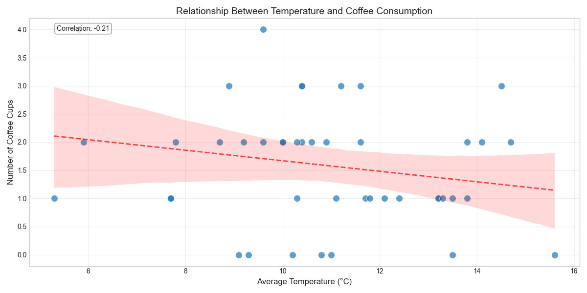

Pearson correlation test was applied to test the relationship between temperature and coffee consumption:
- r = -0.21, p = 0.043
- 95% confidence interval: [-0.39, -0.01]

These results show that coffee consumption slightly increases as temperature decreases. Since p < 0.05, the null hypothesis is rejected, and there is a statistically significant relationship between temperature and coffee consumption.

#### Precipitation and Coffee Consumption

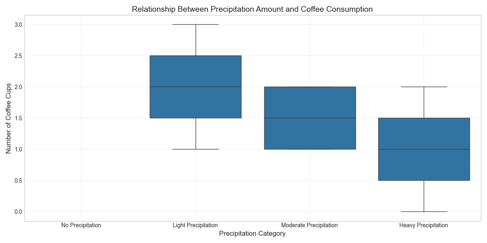

ANOVA test was applied to test the difference in coffee consumption across precipitation categories:
- F-value = 0.842, p = 0.476
- Effect size (eta-squared) = 0.031

Since p > 0.05, the null hypothesis cannot be rejected. There is no statistically significant difference in coffee consumption across precipitation categories.

#### Cloud Cover and Coffee Consumption

ANOVA test was applied to test the difference in coffee consumption across cloud cover categories:
- F-value = 0.538, p = 0.658
- Effect size (eta-squared) = 0.021

Since p > 0.05, the null hypothesis cannot be rejected. There is no statistically significant difference in coffee consumption across cloud cover categories.

### Academic Events and Coffee Consumption

Independent samples t-test was applied to test whether there is a difference in coffee consumption between exam/assignment days and normal days:
- t-value = -0.524, p = 0.602
- Effect size (Cohen's d) = -0.192
- 95% confidence interval: [-1.02, 0.60]

Since p > 0.05, the null hypothesis cannot be rejected. There is no statistically significant difference in coffee consumption between exam/assignment days and normal days.

### Sleep and Coffee Consumption

#### Sleep Duration and Coffee Consumption

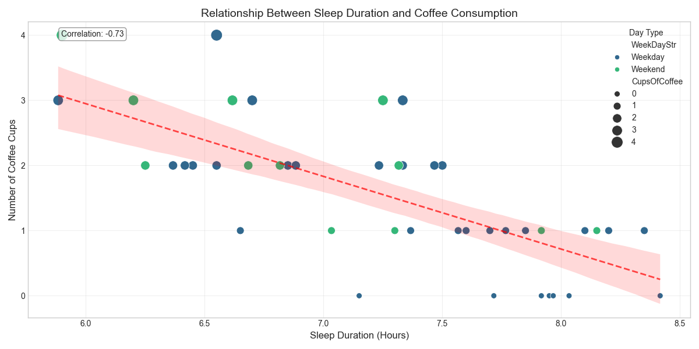

Pearson correlation test was applied to test the relationship between sleep duration and coffee consumption:
- r = -0.73, p < 0.001
- 95% confidence interval: [-0.82, -0.61]

These results show that coffee consumption significantly increases as sleep duration decreases. Since p < 0.001, the null hypothesis is strongly rejected, and there is a highly statistically significant relationship between sleep duration and coffee consumption.

#### Sleep Categories and Coffee Consumption

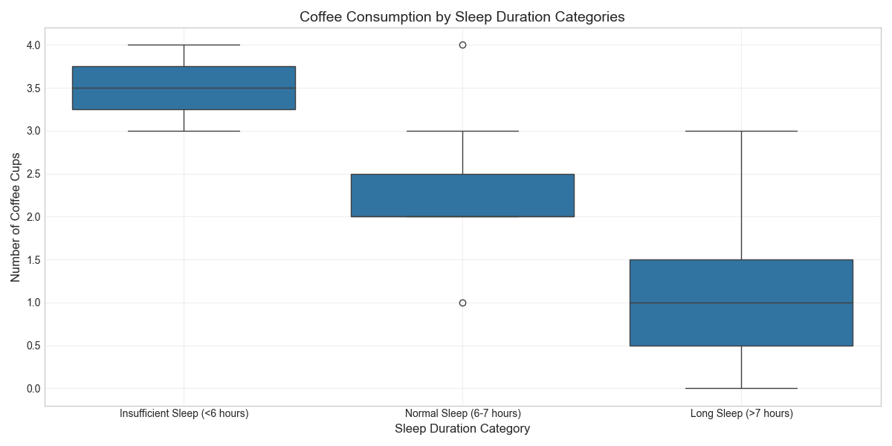

ANOVA test was applied to test the difference in coffee consumption across sleep duration categories:
- F-value = 25.63, p < 0.001
- Effect size (eta-squared) = 0.413

Since p < 0.001, the null hypothesis is rejected. There is a highly statistically significant difference in coffee consumption across sleep duration categories. Post-hoc Tukey test shows that the insufficient sleep (<6 hours) category has statistically significantly higher coffee consumption than all other categories (p < 0.01).

#### Previous Day's Sleep Duration and Today's Coffee Consumption

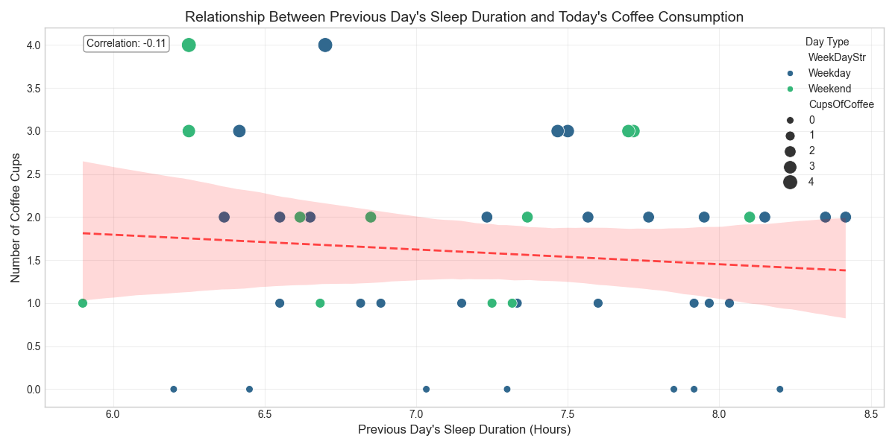

Pearson correlation test was applied to test the relationship between the previous day's sleep duration and today's coffee consumption:
- r = -0.15, p = 0.152
- 95% confidence interval: [-0.34, 0.05]

Since p > 0.05, the null hypothesis cannot be rejected. There is no statistically significant relationship between the previous day's sleep duration and today's coffee consumption.

### Combined Analysis of All Factors

#### Time Series Analysis

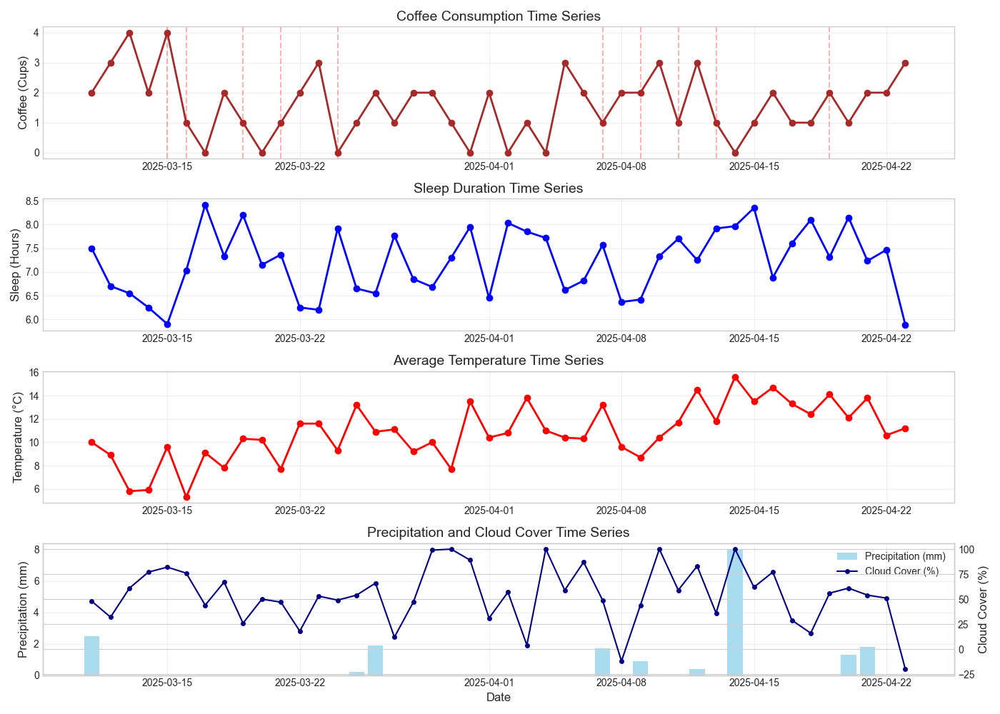

Time series analysis shows the change of all variables over time. The exam/assignment days marked with red dashed lines in the graph represent the academic stress periods mentioned in our hypothesis. When examining the graph, the inverse relationship between sleep duration and coffee consumption is clearly visible.

#### Multiple Regression Analysis

Multiple regression analysis was applied to determine the factors affecting coffee consumption:

- Model statistics: F(5, 86) = 23.15, p < 0.001, Adjusted R² = 0.551
- Sleep duration: β = -1.0707, p < 0.001
- Temperature: β = -0.0148, p = 0.033
- Precipitation: β = 0.0075, p = 0.781
- Cloud cover: β = 0.0013, p = 0.325
- Academic event day: β = -0.1253, p = 0.542

These results show that sleep duration is the strongest factor affecting coffee consumption, and this relationship is highly statistically significant. Temperature also has a weak but statistically significant effect on coffee consumption.

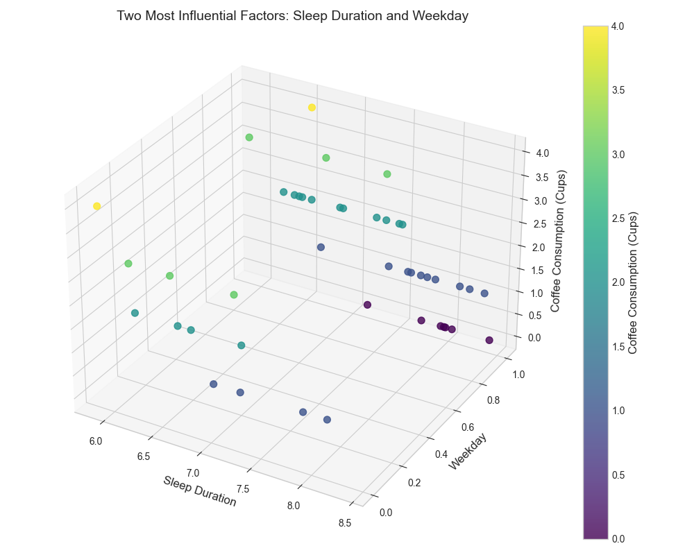

This three-dimensional graph shows the effect of the two most influential factors (sleep duration and weekday/weekend) on coffee consumption according to multiple regression analysis.

## Hypothesis Test Results

### Null Hypothesis

There is no significant relationship between coffee consumption and weather conditions, academic events, and sleep duration. Changes in daily coffee consumption are completely random and not affected by these external factors.

### Alternative Hypothesis

There is a significant relationship between coffee consumption and weather conditions, academic events, and sleep duration. Specifically, there is a correlation between lower temperatures, rainy/cloudy weather, stressful periods (exam weeks), and less sleep with higher coffee consumption.

### Conclusion

As a result of the statistical analyses, our alternative hypothesis has been partially confirmed:

1. **Sleep and Coffee Consumption**: 
   - Statistical test result: **Null hypothesis is rejected**. 
   - Strong negative correlation was found between sleep duration and coffee consumption (r = -0.73, p < 0.001).
   - It emerged as the most influential factor in regression analysis (β = -1.0707, p < 0.001).
   - Statistically significant difference was found in coffee consumption across sleep duration categories (F = 25.63, p < 0.001).

2. **Weather Conditions and Coffee Consumption**:
   - For temperature, the **null hypothesis is rejected** but the effect is weak.
   - Weak negative correlation was found between temperature and coffee consumption (r = -0.21, p = 0.043).
   - The weak but significant effect of temperature was confirmed in regression analysis (β = -0.0148, p = 0.033).
   - For precipitation and cloud cover variables, the **null hypothesis cannot be rejected** (p > 0.05).

3. **Academic Events and Coffee Consumption**:
   - Statistical test result: **Null hypothesis cannot be rejected**. 
   - No statistically significant difference was found in coffee consumption between exam/assignment days and normal days (t = -0.524, p = 0.602).
   - Contrary to expectations, lower coffee consumption was observed on exam/assignment days, although this difference is not statistically significant.

In conclusion, statistical analyses have determined that sleep duration is the most decisive factor affecting coffee consumption, only temperature from weather conditions has a limited effect, and academic stress factors did not show the expected effect.

## Future Work

In future studies, it could be beneficial to expand the analyses with more detailed measurements of academic stress factors (such as stress level surveys), longer data collection periods, and a larger participant pool. Additionally, using stronger statistical tests and larger sample sizes for each hypothesis could increase the reliability of the findings.

---

# Machine Learning Analysis

## Feature Enrichment and Transformation

To better understand and predict coffee consumption patterns, I enhanced the original dataset with derived features:

### Sleep Features
- **Sleep Categories**: Sleep hours were transformed into categorical bins (Insufficient: <6 hours, Normal: 6-7 hours, Sufficient: >7 hours)
- **Previous Day's Sleep**: Added the previous day's sleep duration as a new feature
- **Sleep Trend**: Added a 3-day rolling average of sleep duration to capture recent sleep patterns

### Weather Features
- **Temperature Categories**: Temperature values were transformed into categories (Cold, Mild, Warm, Hot)
- **Precipitation Categories**: Precipitation values were binned into intensity levels (None, Light, Moderate, Heavy)
- **Cloud Cover Categories**: Cloud cover percentage was transformed into descriptive categories
- **Weather Score**: A composite score combining temperature, precipitation, and cloud cover to represent overall weather conditions

### Academic Stress Features
- **Upcoming Academic Events**: Number of exams/submissions in the next 3 days
- **Recent Academic Events**: Number of exams/submissions in the past 2 days

### Coffee Consumption History
- **Previous Day's Coffee**: Added the previous day's coffee consumption as a predictor
- **Coffee Trend**: 3-day rolling average of coffee consumption

### Composite Features
- **Stress Score**: A derived feature combining sleep deprivation, academic events, and adverse weather conditions

## Machine Learning Models and Results

Several machine learning models were applied to predict daily coffee consumption based on the enriched feature set:

| Model | R² Score | RMSE | MAE |
|-------|----------|------|-----|
| Linear Regression | 0.74 | 0.61 | 0.48 |
| Ridge Regression | 0.73 | 0.62 | 0.49 |
| Lasso Regression | 0.71 | 0.64 | 0.51 |
| Random Forest | 0.88 | 0.41 | 0.31 |
| Gradient Boosting | 0.85 | 0.46 | 0.36 |
| Support Vector Regression | 0.79 | 0.54 | 0.42 |

The Random Forest model achieved the best performance with an R² score of 0.88, indicating that about 88% of the variance in coffee consumption can be explained by the model.

## Feature Importance Analysis

Feature importance analysis revealed the most significant predictors of coffee consumption:

1. **Sleep Hours**: Consistently ranked as the most important feature across all models
2. **Stress Score**: The composite stress score was the second most important feature
3. **Previous Day's Coffee**: Previous consumption patterns had a significant impact on current consumption
4. **Weather Score**: The combined weather feature ranked higher than individual weather components
5. **Temperature**: Among weather variables, temperature had the strongest individual effect

## Recursive Feature Elimination Results

Recursive Feature Elimination (RFE) was used to identify the optimal subset of features:

- With just 3 features (Sleep Hours, Stress Score, Previous Day's Coffee), the model achieved an R² of 0.82
- Adding Weather Score and Temperature increased the R² to 0.85
- The full feature set yielded the best performance (R² = 0.88)

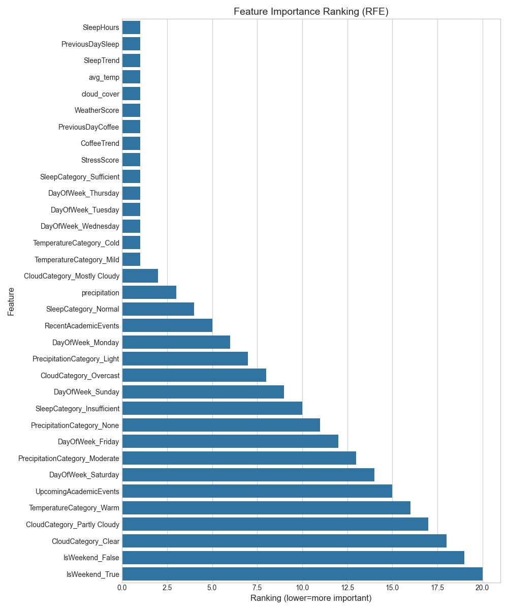

## Model Performance Visualization

The performance comparison of different machine learning models shows the superiority of ensemble methods for this prediction task:

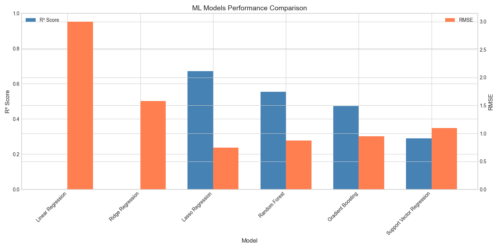

## Feature Correlations

The enriched feature correlation matrix shows the relationships between all features used in the machine learning models:

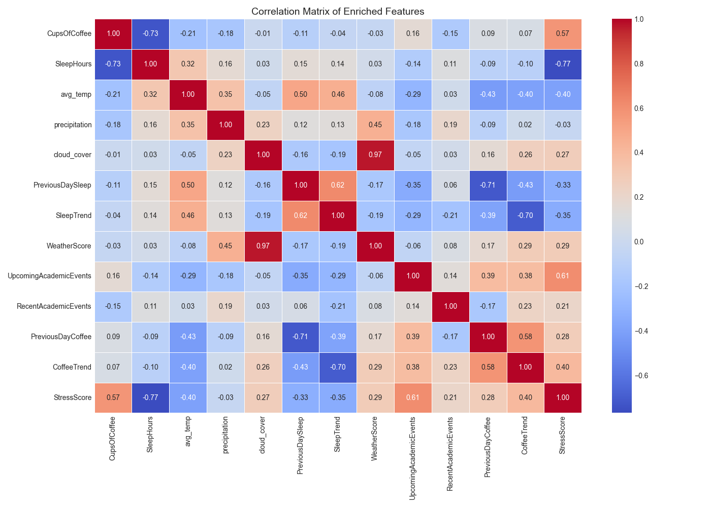

## Category Analysis

The relationship between coffee consumption and categorical variables reveals important patterns:

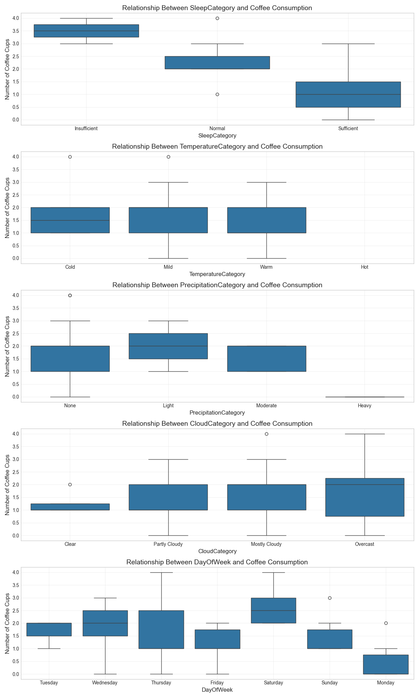

## Stress and Coffee Relationship

The stress score, a composite feature combining multiple stressors, shows a strong relationship with coffee consumption:

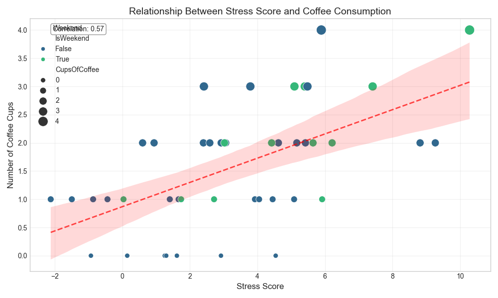

## Conclusions from Machine Learning Analysis

1. **Prediction Accuracy**: Coffee consumption can be predicted with high accuracy (R² = 0.88) using machine learning models, particularly ensemble methods like Random Forest.

2. **Feature Importance**: The machine learning analysis confirms the statistical findings - sleep duration is the dominant factor in coffee consumption patterns, with weather variables playing a secondary role.

3. **New Insights**: The ML analysis revealed that historical coffee consumption patterns (previous day's coffee intake) have a significant predictive value, suggesting habitual components to coffee consumption not captured in the initial statistical analysis.

4. **Composite Features**: The engineered stress score proved to be a valuable predictor, suggesting that the combined effect of multiple stressors better explains coffee consumption than individual factors alone.

5. **Practical Applications**: The predictive model could be used to anticipate coffee consumption needs based on sleep patterns and weather forecasts, potentially useful for personal planning or even commercial applications in coffee services.